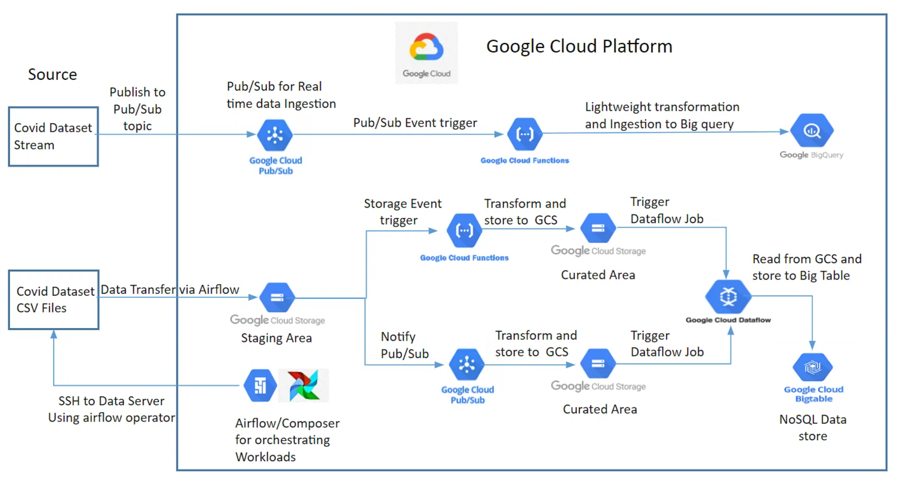

# Building scalable Event Based GCP data pipeline using dataflow

## Dataset

Covid data

## Reasons to use Event Based design pattern:

1. Interoperability
2. Scalability
3. Serverless

## Process

1. Set up service account API on GCP

    A service account is a special kind of Google account that belongs to your application or service, rather than to an individual user. This allows you to limit the scope of the account's permissions and reduce the risk of accidental data breaches or misuse.

    - Enable IAM Service Account Credentials API
    - Add service account and give it "owner" role
    - Create key in JSON format

2. Install GCP SDK
    - run gcloud init
    - set current project
    